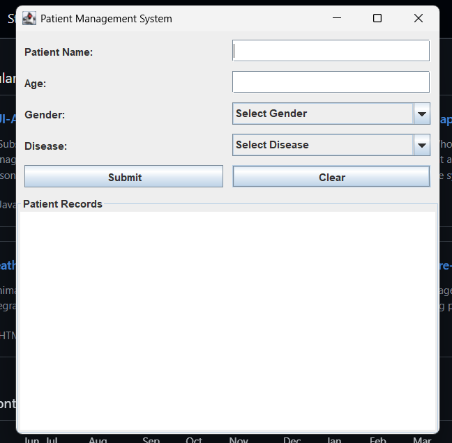

# MedFlow - Patient Management System

A simple Java Swing-based Patient Management System that allows users to enter and manage patient information through a graphical user interface.

## Preview

## Features

- Add patient details
  - Name
  - Age
  - Gender
  - Disease
- User-friendly Java Swing GUI
- Display patient records
- Clear form inputs
- Desktop-based application

## Technologies Used

- Java
- Swing (GUI)
- AWT
- Object-Oriented Programming (OOP)

## Project Structure
